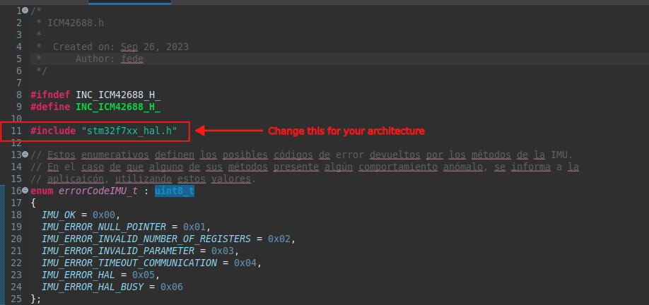

# ICM42688 driver with STM32 HAL

The class defined here is intended to ease use of the ICM42688 IMU sensor from TDK (https://invensense.tdk.com/products/motion-tracking/6-axis/icm-42688-p/) with STM32 microcontrollers. This driver can only use SPI peripherals, and supports blocking mode and interrupt mode for communication with the IMU.

## Installation
Include the files here in your project. Depending on your microcontroller architecture (Cortex M3, M4, M7, etc) you might need to modify the following include in ICM42688.h:



## Usage
First, include the *ICM42688.h* header file in your project. Te following is an example on how to use the driver.

```C++
/* Reset of all peripherals, Initializes the Flash interface and the Systick. */
HAL_Init();

/* USER CODE BEGIN Init */

/* USER CODE END Init */

/* Configure the system clock */
SystemClock_Config();

/* USER CODE BEGIN SysInit */

/* USER CODE END SysInit */

/* Initialize all configured peripherals */
MX_GPIO_Init();
MX_ETH_Init();
MX_USART3_UART_Init();
MX_USB_OTG_FS_PCD_Init();
MX_SPI1_Init();
MX_TIM14_Init();
/* USER CODE BEGIN 2 */

ICM42688 imu(&hspi1, GPIO_PORT_CS_IMU, GPIO_PIN_CS_IMU);
imu.enable_accel_and_gyro();
imu.set_accel_output_data_rate(ICM42688::odrAccel100);
imu.set_gyro_output_data_rate(ICM42688::odrGyro100);


HAL_TIM_Base_Start(&htim14);

pIMU = &imu;
imu.set_interrupt_mode(GPIO_PORT_INT_DATA_READY_IMU, GPIO_PIN_INT_DATA_READY_IMU);
dataReady = 0;

HAL_NVIC_EnableIRQ(EXTI15_10_IRQn);
```

Before instantiation of the imu object, peripherals should be already initialized.

```C++
ICM42688 imu(&hspi1, GPIO_PORT_CS_IMU, GPIO_PIN_CS_IMU);
```
The call to the constructor takes a pointer to the handler of the SPI peripheral that will be used, in this case `&hspi1` This peripheral is already configured when calling the IMU constructor, as well as the GPIOs. The constructor also takes 2 more arguments. These arguments represent the port and pin of the GPIO that will be used as chip-select for the SPI communication. Consult the .cpp file and the .h file for further information.

```C++
imu.enable_accel_and_gyro();
```
This method tells the IMU device to enable the accelerometers and gyroscopes. After calling this method, the IMU is generating measurements but they are not already being sent to the microcontroller. This can be done in different ways.

```C++
imu.set_accel_output_data_rate(ICM42688::odrAccel100);
imu.set_gyro_output_data_rate(ICM42688::odrGyro100);
```
Sets the output data rate of the accelerometer and gyroscopes, this is, the frequency at which the IMU generates a new measurement of accelerometers and gyroscopoes respectively. Refer to the datasheet for further information. The arguments passed to these functions are enum data types, as there is only a limited amount of output data rates that can be selected.

```C++
imu.set_interrupt_mode(GPIO_PORT_INT_DATA_READY_IMU, GPIO_PIN_INT_DATA_READY_IMU);
```
This method enables interrupt mode. In this mode, the IMU toggles one of its digital outputs, called INT1, each time a new data is generated. If that digital output is conneced to the microcontroller, an interrupt service routine can be configured in order to retrieve the latest IMU measurements. The arguments for this method represent which GPIO is used for detecting the interrupt. **THE GPIO MUST BE PREVIOUSLY CONFIGURED IN ORDER TO DETECT THE INTERRUPT**. Also, the interrupt service routine must be defined by the user. Below is an example:

```C++
void HAL_GPIO_EXTI_Callback(uint16_t GPIO_Pin)
{
	if( dataReady == 0)
	{
		pIMU->read_raw_data(&accelX, &accelY, &accelZ, &gyroX, &gyroY, &gyroZ);
		dataReady = 1;
	}
}
```
In this case, an EXTI_Callback is defined. The method `read_raw_data()` is used for retrieving IMU data. In this case, the values are saved in global variables `accelX`, `accelY`, `accelZ`, `gyroX`, `gyroY` and `gyroZ`.
